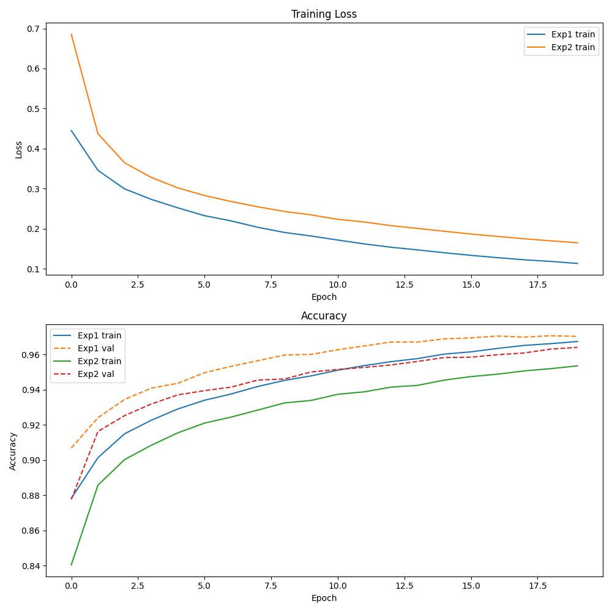
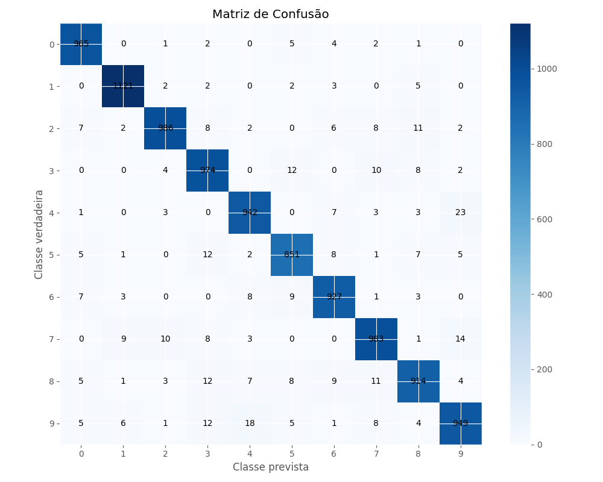
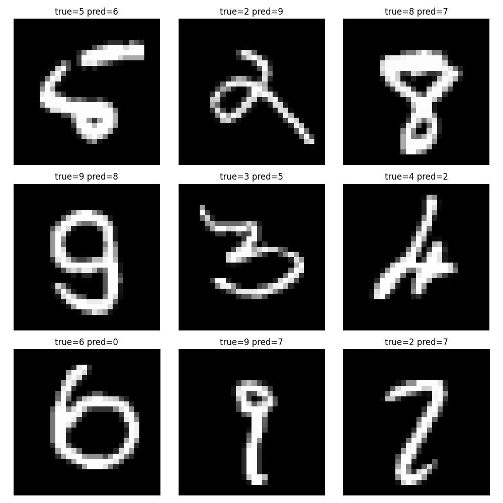

# MLP do Zero — Classificação de Dígitos MNIST

Este projeto implementa um Multi-Layer Perceptron (MLP) do zero usando apenas NumPy. O objetivo é documentar a construção completa do classificador, desde o carregamento dos dados MNIST até o treinamento, avaliação e geração de artefatos.

## O que você encontra aqui

- Implementação do MLP em `mlp/network.py`
- Funções de ativação em `mlp/activations.py`
- Loss e gradiente combinado em `mlp/losses.py`
- Otimizadores SGD e Momentum em `mlp/optimizers.py`
- Loader MNIST em `mlp/data.py`
- Script de experimento em `run_experiments.py`
- Notebook de análise em `notebooks/experimentos.ipynb`

## Estrutura do Projeto

```
.
├── README.md
├── requirements.txt
├── run_experiments.py
├── mlp/
│   ├── __init__.py
│   ├── activations.py
│   ├── data.py
│   ├── losses.py
│   ├── network.py
│   ├── optimizers.py
│   └── __main__.py
├── notebooks/
│   └── experimentos.ipynb
└── results/
    ├── assets/
    │   ├── curvas_treino.png
    │   ├── confusion_matrix.png
    │   └── exemplos_erro.png
    └── comparacao_experimentos.csv
```

## Passo a passo completo

### 1. Configurar ambiente

```powershell
cd "c:\Users\Inteli\Desktop\sophia INTELI\MLP"
python -m venv .venv
.\.venv\Scripts\Activate.ps1
```

### 2. Instalar dependências

```powershell
pip install -r requirements.txt
```

Se der erro de instalação, verifique se o Python está atualizado e se o virtualenv foi ativado corretamente.

### 3. Executar o script de experimentos

```powershell
python run_experiments.py
```

Esse script:

- carrega MNIST via `mlp/data.py`
- divide treino e validação
- treina dois experimentos diferentes
- salva curvas de treino e a matriz de confusão
- grava resultados em `results/comparacao_experimentos.csv`

### 4. Verificar resultados

Os arquivos gerados em `results/` são:

- `assets/curvas_treino.png`
- `assets/confusion_matrix.png`
- `assets/exemplos_erro.png`
- `comparacao_experimentos.csv`

#### Gráficos gerados


_Curvas de loss e acurácia por época._


_Matriz de confusão do melhor experimento no conjunto de teste._


_Exemplos de dígitos classificados incorretamente._

### 5. Abrir o notebook

```powershell
cd notebooks
jupyter notebook experimentos.ipynb
```

O notebook contém visualizações e análises adicionais.

### 6. Testar cada módulo separadamente

```powershell
python -m mlp.activations
python -m mlp.losses
python -m mlp.optimizers
python -m mlp.network
```

Esses testes imprimem exemplos simples de execução e devem rodar sem erro se a instalação estiver correta.

## Explicação detalhada dos arquivos

### `mlp/data.py`

Funções:

- `load_mnist(data_dir, source="auto")`
  - tenta usar `tensorflow.keras.datasets.mnist` quando disponível
  - se não houver TensorFlow, faz download dos arquivos IDX oficiais e lê manualmente

Por que isso é importante?

- evita dependência desnecessária de TensorFlow
- garante que o projeto rode em ambientes leves
- mantém o formato de saída consistente: `X` em `(784, m)` e `y` em `(m,)`

Formato dos dados:

- imagens: `(784, m)`
- rótulos: `(m,)`

A normalização é feita para `0..1`, dividindo por `255.0`.

### `mlp/activations.py`

Contém:

- `relu(z)`
- `relu_backward(z)`
- `sigmoid(z)`
- `sigmoid_backward(z)`
- `tanh(z)`
- `tanh_backward(z)`
- `softmax(z)`

Observações:

- `softmax` é estabilizado subtraindo o máximo de cada coluna.
- a convenção usa colunas como amostras, ou seja, cada coluna de `z` é uma imagem.
- `ACTIVATIONS` registra as funções e as derivadas para uso dinâmico.

### `mlp/losses.py`

Contém:

- `one_hot(y, n_classes)`
- `cross_entropy_loss(A_out, Y)`
- `softmax_crossentropy_backward(A_out, Y)`

Explicação:

- `one_hot` transforma `y: (m,)` em `Y: (n_classes, m)`.
- a loss é a média por exemplo: `-sum(Y * log(A_out)) / m`.
- `softmax_crossentropy_backward` já retorna o gradiente combinado `dZ = (A_out - Y) / m`.

### `mlp/optimizers.py`

Contém:

- classe base `Optimizer`
- `SGD(learning_rate)`
- `SGDMomentum(learning_rate, momentum)`

Observações:

- `SGD` atualiza `theta -= lr * grad`
- `SGDMomentum` mantém lista de velocidades e usa
  `v = beta * v + (1 - beta) * grad`
  `theta -= lr * v`
- o uso de `1 - beta` no cálculo da velocidade é uma variação válida e mantém o gradiente na escala correta.

### `mlp/network.py`

Essa é a parte principal. Ela implementa:

- inicialização de parâmetros
- forward pass
- backward pass
- atualização de parâmetros com o otimizador
- método de treino completo
- método de avaliação
- função de gradient check

#### Inicialização de parâmetros

- pesos: `W[l]` com shape `(n_out, n_in)`
- bias: `b[l]` com shape `(n_out, 1)`
- inicialização de He para as camadas ocultas
- o último layer também usa He (não há problema para Softmax)

A forma das matrizes é importante:

- `X`: `(n_features, m)`
- `W[l]`: `(n_out, n_in)`
- `b[l]`: `(n_out, 1)`
- `Z[l] = W[l] @ A_prev + b[l]`: `(n_out, m)`
- `A[l]`: `(n_out, m)`

#### Forward pass

Para cada camada oculta:

1. `Z_l = W_l @ A_prev + b_l`
2. `A_l = act_fn(Z_l)`
3. armazenar `Z_l` e `A_l` no cache

Para a saída:

1. `Z_out = W_out @ A_prev + b_out`
2. `A_out = softmax(Z_out)`

#### Backward pass

A regra geral é:

- camada de saída: `dZ = A_out - Y`
- gradiente dos pesos: `dW = dZ @ A_prev.T`
- gradiente dos bias: `db = sum(dZ, axis=1, keepdims=True)`
- para camadas ocultas:
  - `dA = W_next.T @ dZ`
  - `dZ = dA * act_backward(Z)`

Isso preserva a forma correta de cada gradiente.

#### Atualização de parâmetros

Os parâmetros são passados ao otimizador em lista plana:

- `params = [W[0], b[0], W[1], b[1], ...]`
- `grads = [dW[0], db[0], dW[1], db[1], ...]`

Assim qualquer otimizador compatível funciona.

#### Treino completo

O método `train(...)` faz:

1. embaralhar os exemplos a cada época
2. dividir em mini-batches
3. executar `forward`
4. calcular gradientes com `backward`
5. atualizar parâmetros
6. avaliar loss e acurácia em treino e validação

O histórico é armazenado em `self.history` para análise posterior.

#### Gradient check

O método `gradient_check(...)` compara gradientes analíticos com gradientes numéricos usando diferenças finitas.

Isso ajuda a detectar erros no backpropagation antes de rodar o treinamento completo.

## O que significa "tudinho"?

### Shapes nos cálculos

- `X_train` : `(784, 60000)`
- `y_train` : `(60000,)`
- `W[0]` : `(128, 784)` para a primeira camada oculta
- `Z[0]` : `(128, batch_size)`
- `A[0]` : `(128, batch_size)`
- `W[1]` : `(64, 128)` para a segunda camada oculta
- `W[2]` : `(10, 64)` para a saída
- `A_out` : `(10, batch_size)`

A transposição aparece em `dW = dZ @ A_prev.T` porque `dZ` tem shape `(n_out, m)` e `A_prev.T` tem shape `(m, n_in)`, resultando em `(n_out, n_in)`.

### Por que usar Softmax + Cross-Entropy?

- o Softmax converte logits em probabilidades somando 1 por coluna
- a Cross-Entropy mede a distância entre probabilidades preditas e verdadeiras
- a combinação permite `dZ = A_out - Y`, o que simplifica o cálculo do gradiente de saída

## Erros comuns e como resolver

### 1. `ModuleNotFoundError` ou `ImportError`

- Verifique se o ambiente virtual está ativado
- Instale as dependências com `pip install -r requirements.txt`
- Se o erro for `tensorflow`, o código já trata esse caso: ele usa fallback IDX quando não existe TensorFlow

### 2. `AssertionError` ao carregar IDX

- isso pode acontecer se os arquivos `.gz` estiverem corrompidos
- apague os arquivos em `data/` e rode novamente
- o arquivo deve ter o magic number correto `2051` para imagens e `2049` para rótulos

### 3. `ValueError: layer_sizes deve ter ao menos 2 elementos`

- o MLP precisa de pelo menos entrada e saída
- use `MLP([784, 128, 64, 10], ...)`

### 4. Shapes inconsistentes no backward

Se o código gerar erros como `shapes (10,64) and (32,64) not aligned`, verifique:

- se `X` está em `(n_features, m)` e não em `(m, n_features)`
- se `W` foi inicializada com `(n_out, n_in)`
- se `A_prev.T` está sendo usado ao calcular `dW`

### 5. Treinamento muito lento ou estouro de memória

- reduza o batch size
- use menos épocas
- verifique se não está carregando dados maiores do que o esperado

### 6. Acurácia travada em 10%

Isso geralmente indica problema de inicialização ou de gradientes:

- pesos inicializados com zero fazem a rede aprender o mesmo para todas as unidades
- verifique se `softmax` e `cross_entropy` estão combinados corretamente
- use o método `gradient_check` para validar os gradientes

### 7. `ValueError: setting an array element with a sequence`

- sinal de que alguma matriz tem formato errado
- verifique especialmente `y_train` e `X_train` antes de treinar

## Como rodar o MLP passo a passo

1. Carregue os dados:

```python
from mlp.data import load_mnist
X_train, y_train, X_test, y_test = load_mnist('./data')
```

2. Crie o modelo:

```python
from mlp.network import MLP
from mlp.optimizers import SGDMomentum
model = MLP([784, 128, 64, 10], activation='relu', optimizer=SGDMomentum(learning_rate=0.01, momentum=0.9), seed=0)
```

3. Treine:

```python
model.train(X_train, y_train, epochs=20, batch_size=64, X_val=X_val, y_val=y_val)
```

4. Avalie:

```python
loss, acc = model.evaluate(X_test, y_test)
print(loss, acc)
```

5. Faça previsões:

```python
y_pred = model.predict(X_test)
```

## Explicações adicionais

### Por que o bias é `(n_out, 1)`?

O bias precisa ser somado a cada coluna de `Z`, e o NumPy faz broadcasting corretamente quando o bias tem dimensão `(n_out, 1)`.

### Qual a diferença entre `SGD` e `SGDMomentum`?

- `SGD` usa apenas o gradiente atual
- `SGDMomentum` acumula uma média ponderada dos gradientes passados
- momentum ajuda a estabilizar o treinamento e acelerar a convergência

### Por que `softmax` é aplicada só na última camada?

Porque a saída do MLP deve ser probabilidades de classe. Nas camadas ocultas usamos `ReLU` para manter não linearidade.

## O que foi implementado e por quê

### MLP básico

O projeto implementa rede totalmente conectada com camadas densas. Cada camada oculta aplica:

- `Z = W @ A_prev + b`
- `A = ReLU(Z)`

A camada de saída aplica:

- `Z_out = W_out @ A_prev + b_out`
- `A_out = softmax(Z_out)`

### Treinamento com mini-batches

O algoritmo é:

- `for epoch`
  - embaralhar dados
  - dividir em pedaços de `batch_size`
  - fazer forward / backward / update
  - calcular métricas no fim da época

### Validação

O código permite passar `X_val` e `y_val` para comparação durante o treinamento.

## O que está incluso no projeto

- loader próprio de MNIST
- treinos e validações automáticas
- geração de artefatos para análise
- testes simples de cada módulo
- documentação e explicações

## Conclusão

Este projeto entrega uma implementação completa e didática de um MLP para classificação MNIST usando apenas NumPy. Ele integra:

- carregamento de dados robusto com fallback IDX
- funções de ativação e derivadas reutilizáveis
- loss e gradiente combinados para Softmax + Cross-Entropy
- otimizadores `SGD` e `SGDMomentum`
- forward / backward / atualização de parâmetros
- treinamento por mini-batches com validação
- geração automática de gráficos e métricas de desempenho

O resultado é um repositório pronto para estudo, depuração e extensão. Se você quiser, posso também gerar uma seção extra com as escolhas de hiperparâmetros, resultados numéricos detalhados e recomendações para próximos experimentos.