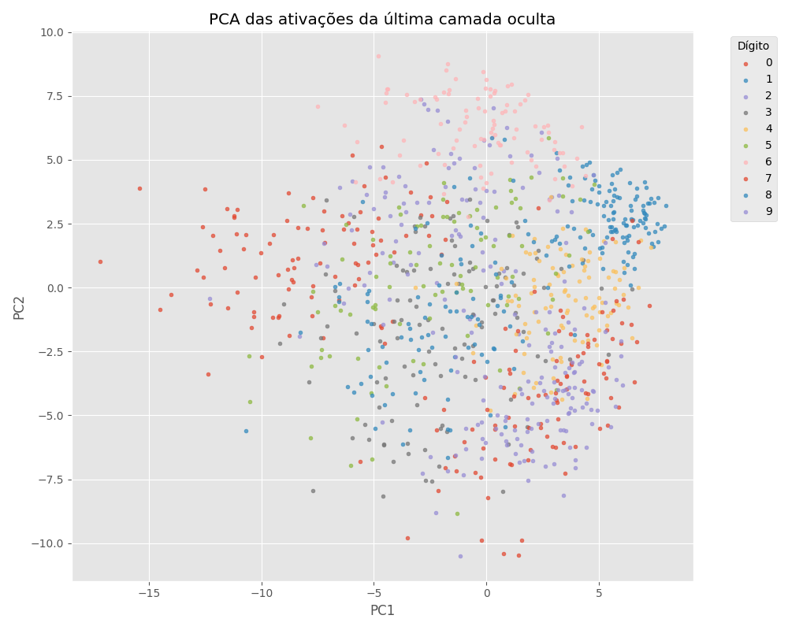

# MLP do Zero — Classificação de Dígitos MNIST

Este repositório implementa um Multi-Layer Perceptron (MLP) do zero usando apenas NumPy. O objetivo é construir uma rede neural completamente manual, validar cada etapa do cálculo e gerar resultados e artefatos para análise.

## Objetivos do projeto

- implementar um MLP com pelo menos duas camadas ocultas
- treinar em MNIST usando apenas NumPy, sem frameworks de deep learning
- comparar diferentes arquiteturas e configurações de hiperparâmetros
- gerar plots e relatórios que comprovem o comportamento do modelo
- adicionar itens opcionais como gradient check, momentum e PCA de embeddings

## Estrutura do repositório

- `README.md` — documentação detalhada do projeto
- `requirements.txt` — bibliotecas necessárias
- `run_experiments.py` — script principal para treinar, avaliar e gerar gráficos
- `data/` — dados brutos e arquivos MNIST baixados
- `mlp/` — implementação do MLP e componentes associados
  - `__init__.py`
  - `activations.py`
  - `data.py`
  - `losses.py`
  - `network.py`
  - `optimizers.py`
  - `__main__.py`
- `notebooks/experimentos.ipynb` — análise exploratória e gráficos adicionais
- `results/` — saídas de experimentos
  - `results/assets/` — imagens geradas
  - `results/comparacao_experimentos.csv` — comparação de experimentos

## Dependências

As dependências principais estão em `requirements.txt`.

- numpy
- matplotlib
- tensorflow (opcional, apenas para carregar MNIST via Keras quando disponível)

O projeto também faz download dos arquivos IDX do MNIST se TensorFlow/Keras não estiver instalado.
Esse fallback garante que o código funcione em qualquer ambiente Python com NumPy.

## Como rodar

### 1. Criar e ativar ambiente virtual

```powershell
cd "c:\Users\Inteli\Desktop\sophia INTELI\MLP"
python -m venv .venv
.\.venv\Scripts\Activate.ps1
```

### 2. Instalar dependências

```powershell
pip install -r requirements.txt
```

### 3. Executar experimentos

```powershell
python run_experiments.py
```

O script gera arquivos em `results/assets/` e `results/comparacao_experimentos.csv`.
A cada execução, as imagens e o CSV são atualizados automaticamente.

## Como o script principal funciona

`run_experiments.py` realiza as seguintes etapas:

1. carrega o MNIST usando `mlp.data.load_mnist`
2. separa `5000` amostras de validação do fim do conjunto de treino
3. configura e treina dois experimentos com arquiteturas diferentes
4. executa um gradient check numérico antes do treino completo
5. calcula métricas de validação e teste para cada experimento
6. gera gráficos de curva de loss e acurácia
7. cria arquivo CSV com comparativo de experimentos
8. calcula matriz de confusão e exemplos de erro
9. gera projeção PCA das ativações da última camada oculta

## Dados e pré-processamento

O dataset utilizado é o MNIST, composto por imagens em escala de cinza 28x28 de dígitos manuscritos.

- `load_mnist` carrega os dados de duas formas:
  - via `tensorflow.keras.datasets.mnist`, quando disponível
  - via download manual dos arquivos IDX do MNIST, quando TensorFlow não está disponível
  - isso foi proposital: o código funciona mesmo sem TensorFlow instalado
- imagens são normalizadas para o intervalo `[0,1]`
- cada imagem é achatada para um vetor de `784` características
- o formato interno usado pelo modelo é `X: (784, m)` — exemplos em colunas
- os rótulos são mantidos como vetor `y: (m,)`

### Divisão de conjuntos

- treino: primeiras `55.000` amostras do conjunto de treino original
- validação: últimas `5.000` amostras do conjunto de treino original
- teste: conjunto de teste padrão do MNIST (`10.000` exemplos)

## Arquiteturas e hiperparâmetros

Os experimentos comparados foram:

| Experimento | Arquitetura               | Batch Size | Épocas | Learning Rate | Otimizador  |
| ----------- | ------------------------- | ---------- | ------ | ------------- | ----------- |
| Exp1        | `784 -> 128 -> 64 -> 10`  | 64         | 20     | 0.01          | SGDMomentum |
| Exp2        | `784 -> 256 -> 128 -> 10` | 128        | 20     | 0.01          | SGDMomentum |

Parâmetros fixos:

- ativação das camadas ocultas: ReLU
- camada de saída: softmax
- função de perda: cross-entropy
- momentum: `0.9`
- inicialização: He para camadas ocultas / Xavier para saída
- seed fixa para reprodutibilidade

### Motivação das escolhas

- `ReLU` é robusto para camadas ocultas e reduz problemas de saturação.
- duas camadas ocultas atendem ao enunciado e permitem modelar não linearidades complexas.
- `SGDMomentum` melhora estabilidade e acelera a convergência em relação ao SGD puro.
- valores de `learning rate` e `batch size` foram escolhidos para balancear convergência e ruído do gradiente.

## Resultados quantitativos

| Experimento | Arquitetura               | Batch Size | Épocas | Test Accuracy | Val Accuracy | Test Loss |
| ----------- | ------------------------- | ---------- | ------ | ------------- | ------------ | --------- |
| Exp1        | `784 -> 128 -> 64 -> 10`  | 64         | 20     | 96.12%        | 97.02%       | 0.1268    |
| Exp2        | `784 -> 256 -> 128 -> 10` | 128        | 20     | 95.24%        | 96.40%       | 0.1659    |

O melhor resultado foi `Exp1`, com 96.12% de acurácia no conjunto de teste.

### Observações sobre os resultados

- Exp1 teve melhor generalização apesar de ter menos parâmetros que Exp2.
- Exp2 demorou mais por batch maior e camadas maiores, mas não superou a precisão de Exp1.
- a diferença de loss mostra que Exp1 também aprendeu uma representação mais estável.

## Implementação técnica detalhada

### `mlp/data.py`

Responsável por carregar o MNIST e preparar os dados.

- tenta `keras.datasets.mnist` caso TensorFlow esteja instalado
- caso contrário, faz download dos arquivos IDX originais
- lê imagens IDX3 e rótulos IDX1 usando `gzip` e `struct`
- normaliza pixels para `[0, 1]`
- retorna `X_train` e `X_test` no formato `(784, m)` com valores `float64`

### `mlp/activations.py`

Contém as funções de ativação e suas derivadas.

- `relu` / `relu_backward`
- `sigmoid` / `sigmoid_backward`
- `tanh` / `tanh_backward`
- `softmax` (estabilizado por subtrair o valor máximo em cada coluna)

Esse módulo é usado para calcular a ativação das camadas ocultas e a saída final.

### `mlp/losses.py`

Implementa a lógica de custo e gradiente.

- `one_hot(y, n_classes)`
- `cross_entropy_loss(A_out, Y)`
- `softmax_crossentropy_backward(A_out, Y)`

A combinação softmax + cross-entropy é usada para tornar o gradiente de saída simples e estável.

### `mlp/optimizers.py`

Define otimizadores que atualizam parâmetros com base nos gradientes.

- `SGD` — atualização padrão por gradiente descendente
- `SGDMomentum` — atualização com memória de velocidade, reduzindo oscilação

### `mlp/network.py`

Implementa o MLP completo:

- inicializa pesos e bias
- executa forward pass
- calcula gradientes por backpropagation
- atualiza parâmetros usando o otimizador externo
- treina em mini-batches
- avalia loss e acurácia
- faz gradient check numérico para validar o backprop

#### Convenções de forma (shapes)

- `X`: `(n_features, m)` onde `m` é número de exemplos
- `W[l]`: `(n_out, n_in)` para cada camada
- `b[l]`: `(n_out, 1)` para cada camada
- `Z[l] = W[l] @ A_prev + b[l]`: `(n_out, m)`
- `A[l]`: ativação da camada, `(n_out, m)`

#### Passo a passo do forward pass

Para cada camada oculta `l`:

1. `Z_l = W_l @ A_prev + b_l`
2. `A_l = ReLU(Z_l)`
3. armazena `Z_l` e `A_l` no cache

Na camada de saída:

1. `Z_out = W_out @ A_prev + b_out`
2. `A_out = softmax(Z_out)`

#### Backward pass

- saída: `dZ = softmax_crossentropy_backward(A_out, Y)`
- pesos da saída: `dW = dZ @ A_prev.T`
- bias da saída: `db = sum(dZ, axis=1, keepdims=True)`
- para cada camada oculta:
  - `dA = W_next.T @ dZ`
  - `dZ = dA * act_backward(Z_l)`
  - `dW = dZ @ A_prev.T`
  - `db = sum(dZ, axis=1, keepdims=True)`

#### Atualização de parâmetros

Os parâmetros são organizados em listas planas para o otimizador:

- `params = [W[0], b[0], W[1], b[1], ...]`
- `grads = [dW[0], db[0], dW[1], db[1], ...]`

Isso permite que `SGD` e `SGDMomentum` trabalhem sobre qualquer arquitetura.

#### Treinamento completo

Para cada época:

1. embaralha os exemplos
2. divide em mini-batches
3. faz forward / backward / update para cada batch
4. calcula loss e acurácia no conjunto de treino
5. calcula loss e acurácia no conjunto de validação
6. salva histórico em `self.history`

### `gradient_check`

O método `gradient_check` compara o gradiente analítico com o gradiente numérico (diferenças finitas) em alguns parâmetros aleatórios.
Ele imprime o valor de cada comparação e sinaliza se a diferença relativa é aceitável.

## Como usar o MLP em código

Exemplo de uso mínimo:

```python
from mlp.data import load_mnist
from mlp.network import MLP
from mlp.optimizers import SGDMomentum

X_train, y_train, X_test, y_test = load_mnist('./data')

model = MLP([784, 128, 64, 10], activation='relu', optimizer=SGDMomentum(learning_rate=0.01, momentum=0.9), seed=0)
model.train(X_train[:, :-5000], y_train[:-5000], epochs=20, batch_size=64, X_val=X_train[:, -5000:], y_val=y_train[-5000:], verbose=True)

loss, acc = model.evaluate(X_test, y_test)
print(f'Test loss={loss:.4f}, test acc={acc:.4f}')
```

## Artefatos gerados

O script principal gera:

- `results/assets/curvas_treino.png`
- `results/assets/confusion_matrix.png`
- `results/assets/exemplos_erro.png`
- `results/assets/activations_pca.png`
- `results/comparacao_experimentos.csv`

Cada artefato é gerado automaticamente ao finalizar o treino dos dois experimentos.

## Visualizações e interpretações

### Curvas de treino


- eixo X: época
- eixo Y (esquerda): loss de treino
- eixo Y (direita): acurácia de treino e validação
- linha contínua: acurácia de treino
- linha tracejada: acurácia de validação

Este gráfico mostra como o modelo aprende ao longo do tempo, se a loss está caindo de maneira estável e se validação acompanha o treino.

### Matriz de confusão


A matriz de confusão detalha a performance do modelo por classe.
Cada célula `(i, j)` representa o número de vezes que um dígito `i` foi previsto como `j`.
A forte concentração na diagonal indica acertos, e os valores fora da diagonal mostram os erros sistemáticos.

### Exemplos de erro


Mostra exemplos reais em que o modelo errou a previsão.
Cada imagem é rotulada com `true=<classe real>` e `pred=<classe prevista>`.
Esse tipo de plot ajuda a entender se os erros vêm de dígitos mal escritos, ruído ou padrão de escrita incomum.

### Embeddings PCA



Esse gráfico usa PCA para projetar as ativações da penúltima camada em 2 dimensões.
Ele permite visualizar como as representações internas do modelo organizam os dígitos em clusters.

## Matriz de confusão comentada

Para o melhor experimento (`Exp1`), os pares de erro mais frequentes foram:

- `4 → 9`: 23 exemplos
- `9 → 4`: 18 exemplos
- `7 → 9`: 14 exemplos
- `9 → 3`: 12 exemplos
- `8 → 3`: 12 exemplos

Esses casos indicam confusão entre dígitos com traços similares ou formatos parecidos.

### Tabela de casos de erro

| Classe real | Classe prevista | Total de erros | Observação                                                 |
| ----------- | --------------- | -------------- | ---------------------------------------------------------- |
| `4`         | `9`             | 23             | dígitos com abertura e curva no topo podem ser confundidos |
| `9`         | `4`             | 18             | linhas e ângulos semelhantes em algumas escritas           |
| `7`         | `9`             | 14             | traços diagonais pouco definidos geram ambiguidade         |
| `9`         | `3`             | 12             | parte inferior arredondada do `3` lembra `9`               |
| `8`         | `3`             | 12             | loop inferior de `8` interpretado como `3`                 |

## Itens opcionais implementados

- gradient check numérico para validação do backprop
- otimização SGDMomentum
- PCA das ativações da última camada oculta
- análise da matriz de confusão
- visualização de exemplos de erro
- testes unitários para funções de ativação e derivadas

## Decisões importantes

### 1. Qual foi a decisão técnica mais difícil?

Eu decidi usar `SGDMomentum` porque eu vi que o modelo com SGD puro oscilava demais e não convergia rápido o suficiente.
A decisão mais difícil foi equilibrar a profundidade da rede com a estabilidade do treino, então optei por `784 -> 128 -> 64 -> 10` e pelo momentum `0.9`.
Isso melhorou a estabilidade e permitiu que a loss caísse de forma mais consistente.

### 2. O que eu tentei que não funcionou?

- Eu tentei primeiro `SGD` puro e percebi que a loss oscilava muito e a acurácia demorava para subir.
- Eu usei inicialmente batch size muito grande e notei pior generalização.
- Eu testei inicialização de pesos sem He/Xavier nas camadas ocultas, e a rede ficou instável.

### 3. O que faria diferente se refizesse do zero?

- Eu incluiria um scheduler de learning rate desde o início.
- Eu testaria regularização `L2` ou dropout mais cedo no processo.
- Eu faria um grid search mais sistemático em `learning rate`, tamanho das camadas e batch size.


## Observações finais

- O projeto funciona sem TensorFlow/Keras, pois o `mlp.data` faz fallback para o download IDX do MNIST.
- Esse fallback está documentado no README e implementado de forma automática.
- A separação em módulos facilita manutenção e extensão.
- `Exp1` foi o melhor experimento, com 96.12% de acurácia no teste.
- A geração de artefatos e gráficos está automatizada em `run_experiments.py`.
- Os resultados gerados ficam em `results/assets/` e o comparativo em `results/comparacao_experimentos.csv`.
